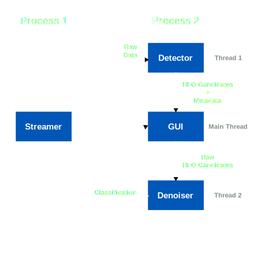

# Guidelines

## Installation
Install [uv](https://docs.astral.sh/uv/) and run:
```bash
git clone https://github.com/raahijogani/hfovis.git
cd hfovis
uv sync
```

## Overview



There are two processes (which in reality have been implemented as threads): the
streamer and the rest of the application. For the rest of the application, the streamer
is effectively a black box that provides a stream of uniformly sized chunks of iEEG
data. The remaining threads (detector, GUI, and denoiser) are all `QThread` instances
and thus communicate with one another through signals and slots.


## Adding/Removing Dependencies

To add or remove dependencies run:
```bash
uv add <dependency>
```
or
```bash
uv remove <dependency>
```
This will update the `pyproject.toml` file and install the new dependencies.

## Style

Install [ruff](https://docs.astral.sh/ruff/installation/) for fast linting and
formatting. For docstrings, use the
[Numpy/Scipy style](https://numpydoc.readthedocs.io/en/latest/format.html#docstring-standard).

## Structure

The code is structured as follows:

- `hfovis/`: The main package containing the core functionality.
    - `interface.py`/`interface.ui`: Code generated by `designer6` for the user
      interface elements and layouts. 
    - `data/`: Modules to handle data processing and storage.
        - `buffering.py`: Contains buffers like the `RingBuffer`.
        - `ieeg_loader.py`/`loaders.py`: Handles loading iEEG data from `.mat`
        files. 
        - `streaming.py`: Creates virtual streams to simulate real-time data.
    - `denoiser/`: Modules for denoising HFO candidates.
        - `data/` : Contains the model weights for the denoiser.
        - `omp.py`: Contains the orthogonal matching pursuit implementation.
        - `features.py`: Extracts features from the OMP results.
        - `vfactor.py`/`normalize.py`: Helpers for getting features.
        - `worker.py`: Contains `DenoisingThread`, which runs in the background
          of the GUI.
    - `detector/`
        - `detector.py`: Contains the `RealTimeDetector` thread, which directly
          interfaces with the stream and sends events to the GUI.
        - `config.py`: Contains the configuration for the real-time detector.
    - `gui/`: Contains all of the logic for the elements defined in
    `interface.py`.
        - `main_window.py`: Contains the main window logic and event handling.
        - `config.py`: Contains the general configuration parameters for the
        GUI.
        - `config_menu.py`: Contains the logic for the configuration menu.
        - `model.py`: Stores the events and their metadata.
        - `*.py`: Other modules for various GUI components.
- `main.py`: Script to run the demo (or application in the future).

## Modifying the UI

To modify the UI, use the `designer6` tool to edit `interface.ui` and then run:
```bash
pyuic6 hfovis/interface.ui -o hfovis/interface.py
```
to regenerate the `interface.py` file.

## Adding/Removing Configuration Parameters

For any submodule that requires user-defined configuration parameters, create a
`config.py` file, create a `dataclass` with your parameters, and add it to list
of configs given to `hfovis.gui.config_menu.ConfigMenu` in
`hfovis/gui/main_window.py`. Give the name that should be displayed for your
configuration by setting `name`. Be sure to add `get_validation_messages`, and
`update` to your configuration class. The `get_validation_messages` method
should return a dictionary of error messages for each parameter keyed by the
name of the parameter. The `update` method should take in `**kwargs` and assign
the values to the parameters in the class, effectively like a Python `dict`.
Optionally you, should probably also add a `validate` method that checks if the
configuration is valid and run it in the `update` method.

> **Note:** It might be worth creating an interface with these methods if enough
> configuration classes are required.

Example:
```python
from dataclasses import dataclass, field

@dataclass
class MyConfig:
    name: str = "My Config"

    param1: int = field(
        default=0,
        metadata={
            "label": "Label that should be displayed on config menu",
            "description": "Description shown on hover tooltip",
            "valid": lambda x: x > 0,  # Validation function
            "error_message": "Message shown to user if validation fails",
            "editable_after_start": False, # Whether this can be edited after
                                           # the app starts. True by default. 
        }
    )

    file1: str = field(
        default="",
        metadata={
            "label": "File 1",
            "description": "Description for file 1",
            "valid": lambda x: x.endswith('.txt'),  # Example validation
            "error_message": "File must be a .txt file",
            "file_dialog": "create file", # Either "create file" or "find file". 
                                          # Use create file to create a new 
                                          # file, or find file to select an 
                                          # existing file.
            "file_filter": "Text files (*.txt)",
            "file_extension": ".txt"
        }
    )

    # implement more parameters and methods...
```

