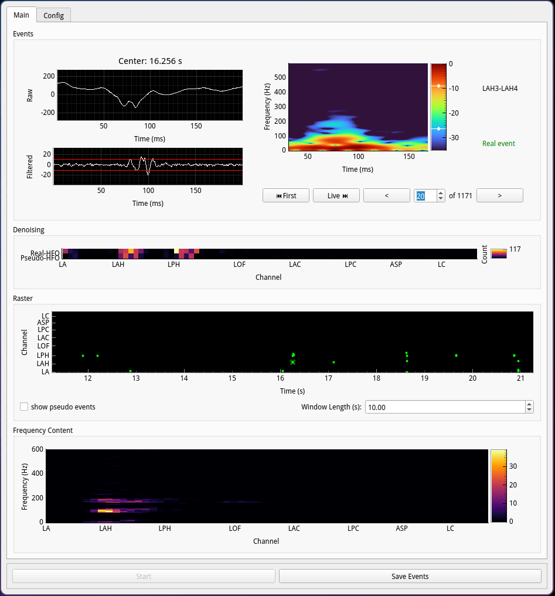
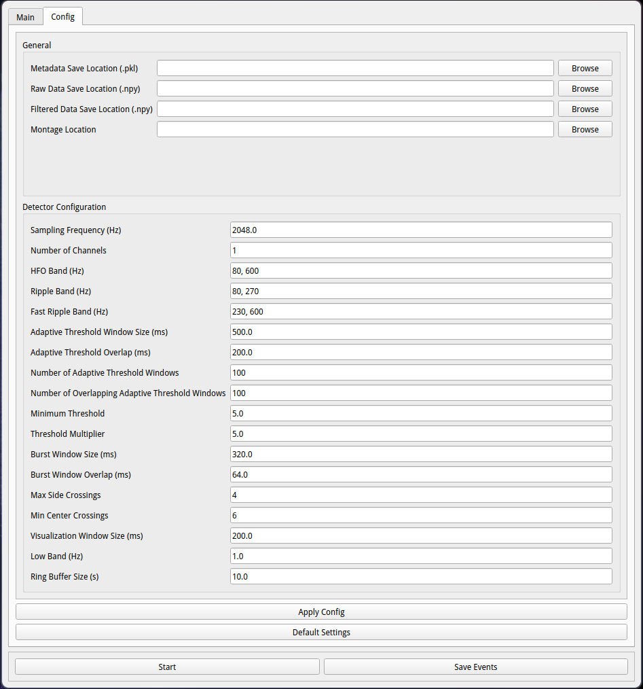
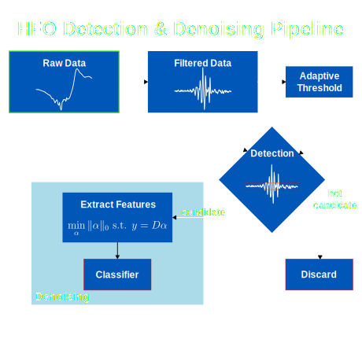

# hfovis

A real-time GUI for detecting, denoising, and visualizing high-frequency
oscillations (HFOs).


- [Installation](#installation)
- [Demo](#demo)
- [Usage](#usage)
    - [Events Panel](#events-panel)
    - [Denoising Panel](#denoising-panel)
    - [Raster Plot](#raster-plot)
    - [Frequency Content Plot](#frequency-content-plot)
- [Configuration Menu](#configuration-menu)
    - [Pipeline](#pipeline)
    - [Save/Montage Location](#savemontage-location)
    - [Detector Parameters](#detector-parameters)
- [Custom Streams](#custom-streams)

## Installation

Clone this repository and install the dependencies listed in `pyproject.toml`.

It is recommended to use [uv](https://docs.astral.sh/uv/) to recreate the
virtual environment for this project. Run:

```bash uv sync ```

This will create a virtual environment. Source or run the activation script in
order to activate the environment.

## Demo

To run the demo, create a `data/` directory in the root of the repository and
place your .mat iEEG file in it. In `main.py` change `"Filename_interictal":
"demo_data.mat",` to the name of your file.

Then, activate your virtual environment and run:

```bash python main.py ```

This will simulate a real-time stream at the specified sampling rate given to
the `DataStreamer`.

Click `Start` in the bottom left corner and switch to the `Main` tab to see the
events as they are detected.

## Usage




### Events Panel 
The Events panel allows for navigation through the pool of detected events. The
left two plots show the raw and filtered iEEG signal captured around the event.
On the right is a spectrogram and labels for the channel the selected event was
detected on and whether it was classified as a real or pseudo-HFO. There are
four buttons for navigating through the events:
- **First**: Jump to the first event in the pool.
- **Live**: Jump to the last event in the pool or keep up with the latest events
as they are detected.
- **<** (previous): Jump to the previous event in the pool.
- **>** (next): Jump to the next event in the pool.

> **Note:** You can also use the spinbox to navigate through the events quickly.

### Denoising Panel

This panel shows a heatmap of the counts of real and pseudo-HFO events per
channel.

### Raster Plot

A raster plot of the detected events over channels and time. Green points
indicate events that have been classified as real HFOs, while red points
indicate pseudo-HFOs. White points indicate events that have not been classified
yet. If "show pseudo events" isn't checked, only real HFOs will be shown in
green and unverified points in white. The event shown in the Events panel is
marked with an 'X' and centered in the plot.

You can change the length of the time window shown in the raster plot with the
spin box.

### Frequency Content Plot

This heatmap shows the counts of events per channel in each frequency bin from
0-600 Hz. The frequency of each event is calculated by taking the peak of the
Fourier transform of the event.

> **Note:** Right-clicking on any of the colorbars will allow you to change the
> colormap.

## Configuration Menu



> **Note:** All detector parameters and the `Montage Location` cannot be changed
> after starting the stream. Hovering over the parameters will show a tooltip
> with their description.

### Pipeline

At a high level, pipeline consists of the following steps:

1. **Filtering**: The raw iEEG signal is filtered to isolate the HFO band
   (80-600 Hz) by default.
2. The filtered signal is split into two streams:
    - **Adaptive Thresholding**: The standard deviations of overlapping windows
    of the filtered signal are computed. Then, the median of overlapping windows
    of the standard deviation is multiplied to determine the threshold for
    detection.
    - **Detection**: Overlapping windows of the filtered signal are compared
    against the threshold to detect crossings. Sufficiently many crossings must
    occur sufficiently close together with fewer than a certain number of
    crossings on the first and last third of the window for the window to be
    considered a candidate event.
3. **Denoising**: Candidate events are passed through an orthogonal
   matching pursuit (OMP) classifier to compute certain features. These features
   are then passed through a random forest classifier to determine whether the
   event is a real or pseudo-HFO.



### Save/Montage Location

Metadata about each event (the timestamp of the center of the event, the channel
on which it occurred, the threshold used to detect it, and whether it was a real
HFO) is saved to a .pkl file at the specified location.

The filtered and raw signals for each event are stored in a .npy file at the
respective specified locations.

Format your montage file as plain text with the name of each channel on a new
line.

### Detector Parameters

The configuration menu allows you to change the following parameters:

| Pipeline | Parameter | Description |
|----------|-----------|-------------|
| General | Sampling Rate (Hz) | The sampling rate of the iEEG signal in Hz. |
| | Number of Channels | The number of channels in the iEEG signal. |
| | Visualization Window Size (ms) | The size of the window that is used for visualization and storage in milliseconds. |
| | Ring Buffer Size (s) | A ring buffer is used to retrieve raw event data upon detection. This parameter should be sufficiently large to retrieve old values. |
| | Low Band (Hz) | The lower bound for offsetting DC drift in the filtered signal. |
| Filtering | HFO Band (Hz) | The frequency band used for HFO detection. |
| | Ripple Band (Hz) | The frequency band used for extracting the ripple band. (**Note:** not currently used) |
| | Fast Ripple Band (Hz) | The frequency band used for extracting the fast ripple band. (**Note:** not currently used) |
| Adaptive Thresholding | Adaptive Threshold Window Size (ms) | The size of the windows used for adaptive thresholding in milliseconds. |
| | Adaptive Threshold Overlap (ms) | The overlap between the windows used for adaptive thresholding in milliseconds. |
| | Number of Adaptive Threshold Windows | The number of standard deviations used for computing the median to get the adaptive threshold. |
| | Number of Overlapping Adaptive Threshold Windows | The overlap between windows of standard deviations for adaptive thresholding. |
| | Minimum Threshold | The minimum threshold that must be used in case the adaptive threshold is too low. |
| | Threshold Multiplied | The factor by which the adaptive threshold is multiplied to determine the final threshold for detection. |
| Detection | Burst Window Size (ms) | The size of windows used for detecting candidate events.
| | Burst Window Overlap (ms) | The overlap between the windows used for detecting candidate events in milliseconds. |
| | Max Side Crossings | The maximum number of crossings allowed in the first and last third of the window for a candidate event to be considered valid. |
| | Min Center Crossings | The minimum number of crossings required throughout window for a candidate event to be considered valid. |

## Custom Streams

If you want to work with your own stream, you will need to implement
`hfovis.data.streaming.Stream` with `start()`, `stop()`, and `read()` methods.

In general, once you have a `Stream` object, it can be fed into the
`hfovis.detector.RealTimeDetector` as follows:

```python
stream = MyStream()  # Your custom stream implementation

# ...boilerplate code in main.py 
main = hfovis.gui.MainWindow(stream)
```

# Contributing

Please see the [CONTRIBUTING.md](./CONTRIBUTING.md) file for guidelines on
contributing to this project.
